# Acadedx ER Diagram

**Document Version:** 1.1.0  
**Status:** Approved  
**Last Updated:** July 2026  
**Owner:** Solution Architecture  
**Company:** Digital Global Information Systems (DGIS)  
**Database:** PostgreSQL  
**ORM:** Prisma

---

# Purpose

This document defines the Entity Relationship Diagram structure for Acadedx.

It explains the major database entities and their relationships using the future-ready platform model:

```text
Organization
    ↓
Institution
    ↓
Academic Structure
    ↓
Users
    ↓
Learning Activity
```

This document complements:

- DATABASE_SCHEMA.md
- DATA_DICTIONARY.md
- MIGRATIONS.md

---

# Core Design Rule

Acadedx must not model schools as the top-level education entity.

Use:

```text
Institution
```

A school is an Institution type.

This supports future expansion into:

- Schools
- Academies
- Coaching Institutes
- Colleges
- Universities
- Training Centres
- Online Academies

---

# Platform Hierarchy

```text
Platform
    ↓
Organization
    ↓
Institution
    ↓
AcademicSession
    ↓
Grade
    ↓
Section
    ↓
Subject
    ↓
Chapter
    ↓
Topic
```

---

# MVP Constraint

Version 1.0 supports:

```text
One Organization → One Institution
```

This is a business rule.

The database model must still allow future support for:

```text
One Organization → Many Institutions
```

---

# High-Level ER Diagram

```text
Organization
    1 ──── * Institution
              1 ──── * AcademicSession
              1 ──── * Grade
              1 ──── * Section
              1 ──── * InstitutionSettings

User
    1 ──── 1 UserProfile
    1 ──── 0..1 StudentProfile
    1 ──── 0..1 ParentProfile
    1 ──── 0..1 TeacherProfile
    1 ──── * UserRole
    1 ──── * Session

Role
    1 ──── * UserRole
    1 ──── * RolePermission

Permission
    1 ──── * RolePermission
```

---

# Organization and Institution Relationships

```text
Organization
    ├── Institution
    ├── OrganizationSettings
    ├── OrganizationBranding
    ├── Subscription
    ├── Payment
    ├── AuditLog
    └── ActivityEvent
```

```text
Institution
    ├── InstitutionSettings
    ├── AcademicSession
    ├── Grade
    ├── Section
    ├── StudentProfile
    ├── TeacherProfile
    ├── Homework
    ├── Note
    ├── Quiz
    ├── Worksheet
    ├── Notification
    ├── ActivityEvent
    └── AuditLog
```

---

# Identity ER Diagram

```text
User
    1 ──── 1 UserProfile
    1 ──── * UserRole
    1 ──── * Session
    1 ──── * PasswordResetToken
    1 ──── * EmailVerificationToken

Role
    1 ──── * UserRole
    1 ──── * RolePermission

Permission
    1 ──── * RolePermission
```

---

# Identity Relationship Notes

## User to UserProfile

```text
User 1 ──── 1 UserProfile
```

Every user should have one general profile.

---

## User to Role

```text
User * ──── * Role
```

Implemented through:

```text
UserRole
```

UserRole supports optional organization and institution scope.

This allows one user to be:

- Student in one institution
- Teacher in another institution
- Organization administrator for one organization
- Platform administrator at DGIS

---

## Role to Permission

```text
Role * ──── * Permission
```

Implemented through:

```text
RolePermission
```

---

# Organization ER Diagram

```text
User
    1 ──── * Organization
            via ownerUserId

Organization
    1 ──── * Institution
    1 ──── 1 OrganizationSettings
    1 ──── 0..1 OrganizationBranding
    1 ──── * UserRole
    1 ──── * Subscription
    1 ──── * Payment
```

---

# Institution ER Diagram

```text
Organization
    1 ──── * Institution

Institution
    1 ──── * AcademicSession
    1 ──── * Grade
    1 ──── * Section
    1 ──── * StudentProfile
    1 ──── * TeacherProfile
    1 ──── * Homework
    1 ──── * Quiz
    1 ──── * Worksheet
    1 ──── * Note
```

---

# Academic ER Diagram

```text
Institution
    1 ──── * AcademicSession
    1 ──── * Grade

AcademicSession
    1 ──── * Grade

Grade
    1 ──── * Section
    1 ──── * Chapter

Subject
    1 ──── * Chapter

Chapter
    1 ──── * Topic
```

---

# Academic Relationship Notes

## Grade and Section

```text
Grade 1 ──── * Section
```

A grade can have multiple sections.

Examples:

```text
Class 7 → Section A
Class 7 → Section B
```

For coaching institutes, sections may represent batches.

---

## Subject

Subjects may be global or institution-specific.

```text
Subject
    ├── Global Subject
    └── Institution Subject
```

Global examples:

- Mathematics
- Science
- English

Institution-specific examples:

- IIT-JEE Physics Advanced
- NEET Biology Foundation
- Coding Level 1

---

# User Profile ER Diagram

```text
User
    1 ──── 1 UserProfile
    1 ──── 0..1 StudentProfile
    1 ──── 0..1 ParentProfile
    1 ──── 0..1 TeacherProfile
    1 ──── 0..1 LearningProfile

ParentProfile
    * ──── * StudentProfile
        via ParentStudent
```

---

# Parent and Student Relationship

```text
Parent User * ──── * Student User
```

Implemented through:

```text
ParentStudent
```

This supports:

- One parent with multiple children
- One student with multiple guardians
- Shared family access
- Future guardian permissions

---

# Teacher Relationship

Teacher relationships may be institution-based initially.

```text
Institution
    1 ──── * TeacherProfile
```

Future teacher assignment tables may include:

```text
TeacherClassAssignment
TeacherSubjectAssignment
TeacherStudentAssignment
```

These may be introduced when teacher workflows become more detailed.

---

# Learning ER Diagram

```text
StudentProfile / User
    1 ──── * Homework
    1 ──── * Note
    1 ──── * QuizAttempt
    1 ──── * Worksheet
    1 ──── * StudyPlan
    1 ──── * Conversation
    1 ──── * LearningMastery

Homework
    1 ──── * HomeworkAttachment
    1 ──── 0..1 HomeworkSolution
    1 ──── * OcrJob
    1 ──── * AiRequest

Quiz
    1 ──── * QuizQuestion
    1 ──── * QuizAttempt

QuizAttempt
    1 ──── * QuizAnswer

Worksheet
    1 ──── * WorksheetQuestion

StudyPlan
    1 ──── * StudyTask
```

---

# Homework Relationships

```text
User
    1 ──── * Homework

Homework
    1 ──── * HomeworkAttachment
    1 ──── 0..1 HomeworkSolution
```

Homework may optionally relate to:

```text
Subject
Chapter
Topic
Institution
Organization
```

B2C students may create homework without institution context.

Institution-linked students should include institution context.

---

# AI and OCR ER Diagram

```text
User
    1 ──── * AiRequest
    1 ──── * OcrJob
    1 ──── * Conversation

AiRequest
    1 ──── 0..1 AiFeedback

Conversation
    1 ──── * Message

FileAsset
    1 ──── * OcrJob
```

---

# AI Relationship Notes

Every AI-generated feature must create an AI usage record.

Examples:

```text
HomeworkSolution → AiRequest
Note → AiRequest
Quiz → AiRequest
Worksheet → AiRequest
StudyPlan → AiRequest
Message → AiRequest
```

This enables:

- Cost tracking
- Provider tracking
- Model tracking
- Prompt version tracking
- AI quality measurement

---

# OCR Relationship Notes

OCR jobs connect files to extracted content.

```text
FileAsset
    1 ──── * OcrJob
```

OCR output may be used by:

- Homework
- Notes
- Quiz
- Worksheets
- AI Tutor

---

# Analytics ER Diagram

```text
User
    1 ──── * ActivityEvent
    1 ──── * LearningMastery
    1 ──── * Recommendation

Organization
    1 ──── * ActivityEvent

Institution
    1 ──── * ActivityEvent

Subject
    1 ──── * LearningMastery

Chapter
    1 ──── * LearningMastery

Topic
    1 ──── * LearningMastery
```

---

# Learning Mastery Relationships

```text
Student User
    1 ──── * LearningMastery
```

Mastery can be calculated at different levels:

- Subject
- Chapter
- Topic

Only one of these may be populated depending on the mastery granularity.

---

# Recommendation Relationships

```text
Student User
    1 ──── * Recommendation
```

Recommendations may point to:

- Homework
- Notes
- Quiz
- Worksheet
- StudyTask
- Topic
- Chapter
- Subject

Using:

```text
targetEntityType
targetEntityId
```

---

# Commerce ER Diagram

```text
Plan
    1 ──── * PlanFeature

Feature
    1 ──── * PlanFeature
    1 ──── * UsageCounter

Subscription
    * ──── 1 Plan

User
    1 ──── * Subscription

Organization
    1 ──── * Subscription

Institution
    1 ──── * Subscription
```

---

# Subscription Ownership

A subscription may belong to one of:

```text
User
Organization
Institution
```

Business rules decide which ownership field is required.

Examples:

```text
Student Pro → userId
Family Plan → userId of parent owner
Institution Plan → institutionId
Enterprise Plan → organizationId
```

---

# Entitlement Relationships

```text
Plan
    1 ──── * PlanFeature

Feature
    1 ──── * PlanFeature

UsageCounter
    * ──── 1 Feature
```

Entitlements should be evaluated through feature codes, not plan names.

---

# Payment ER Diagram

```text
Subscription
    1 ──── * Payment
    1 ──── * Invoice

Payment
    1 ──── 0..1 Invoice
    1 ──── * Refund

User
    1 ──── * Payment

Organization
    1 ──── * Payment

Institution
    1 ──── * Payment
```

---

# Payment Relationship Notes

Payments may be scoped to:

- User
- Organization
- Institution
- Subscription

Payment provider details must remain isolated in the payment module.

No raw card data should be stored.

---

# Notification ER Diagram

```text
User
    1 ──── * Notification
    1 ──── 1 NotificationPreference

NotificationTemplate
    1 ──── * Notification
        conceptual relationship by category/template code
```

Notifications may include organization and institution context.

---

# Storage ER Diagram

```text
User
    1 ──── * FileAsset

Organization
    1 ──── * FileAsset

Institution
    1 ──── * FileAsset

FileAsset
    1 ──── * HomeworkAttachment
    1 ──── * OcrJob
    1 ──── * Invoice
```

---

# Audit ER Diagram

```text
User
    1 ──── * AuditLog
        via actorUserId

Organization
    1 ──── * AuditLog

Institution
    1 ──── * AuditLog
```

Audit logs may reference any target entity through:

```text
targetType
targetId
```

---

# Mermaid ER Diagram

The following Mermaid diagram provides a simplified relationship view.

```mermaid
erDiagram
    ORGANIZATION ||--o{ INSTITUTION : owns
    ORGANIZATION ||--o{ USER_ROLE : scopes
    ORGANIZATION ||--o{ SUBSCRIPTION : billed_under
    ORGANIZATION ||--o{ PAYMENT : pays

    INSTITUTION ||--o{ ACADEMIC_SESSION : has
    INSTITUTION ||--o{ GRADE : has
    INSTITUTION ||--o{ SECTION : has
    INSTITUTION ||--o{ STUDENT_PROFILE : enrolls
    INSTITUTION ||--o{ TEACHER_PROFILE : employs
    INSTITUTION ||--o{ HOMEWORK : scopes
    INSTITUTION ||--o{ ACTIVITY_EVENT : records

    USER ||--|| USER_PROFILE : has
    USER ||--o| STUDENT_PROFILE : may_have
    USER ||--o| PARENT_PROFILE : may_have
    USER ||--o| TEACHER_PROFILE : may_have
    USER ||--o{ USER_ROLE : assigned
    USER ||--o{ SESSION : has
    USER ||--o{ AI_REQUEST : makes
    USER ||--o{ NOTIFICATION : receives

    ROLE ||--o{ USER_ROLE : assigned
    ROLE ||--o{ ROLE_PERMISSION : includes
    PERMISSION ||--o{ ROLE_PERMISSION : granted

    PARENT_PROFILE ||--o{ PARENT_STUDENT : links
    STUDENT_PROFILE ||--o{ PARENT_STUDENT : linked

    ACADEMIC_SESSION ||--o{ GRADE : contains
    GRADE ||--o{ SECTION : contains
    SUBJECT ||--o{ CHAPTER : contains
    CHAPTER ||--o{ TOPIC : contains

    USER ||--o{ HOMEWORK : creates
    HOMEWORK ||--o{ HOMEWORK_ATTACHMENT : has
    HOMEWORK ||--o| HOMEWORK_SOLUTION : solved_by
    HOMEWORK ||--o{ OCR_JOB : may_use

    USER ||--o{ NOTE : owns
    USER ||--o{ QUIZ : creates
    QUIZ ||--o{ QUIZ_QUESTION : contains
    QUIZ ||--o{ QUIZ_ATTEMPT : attempted
    QUIZ_ATTEMPT ||--o{ QUIZ_ANSWER : contains

    USER ||--o{ WORKSHEET : creates
    WORKSHEET ||--o{ WORKSHEET_QUESTION : contains

    USER ||--o{ STUDY_PLAN : owns
    STUDY_PLAN ||--o{ STUDY_TASK : contains

    USER ||--o{ CONVERSATION : owns
    CONVERSATION ||--o{ MESSAGE : contains

    AI_REQUEST ||--o| AI_FEEDBACK : receives
    FILE_ASSET ||--o{ OCR_JOB : processed_by

    USER ||--o{ ACTIVITY_EVENT : triggers
    USER ||--o{ LEARNING_MASTERY : has
    USER ||--o{ RECOMMENDATION : receives

    PLAN ||--o{ PLAN_FEATURE : includes
    FEATURE ||--o{ PLAN_FEATURE : enabled_by
    FEATURE ||--o{ USAGE_COUNTER : tracked_by
    PLAN ||--o{ SUBSCRIPTION : subscribed_to

    SUBSCRIPTION ||--o{ PAYMENT : generates
    PAYMENT ||--o| INVOICE : produces
    PAYMENT ||--o{ REFUND : may_have

    USER ||--o{ FILE_ASSET : uploads
    FILE_ASSET ||--o{ HOMEWORK_ATTACHMENT : attached_as

    USER ||--o{ AUDIT_LOG : acts
```



---

# Critical Cardinality Rules

## Organization to Institution

```text
Organization 1 ──── * Institution
```

MVP allows one institution per organization.

Future allows many institutions per organization.

---

## Institution to Users

```text
Institution 1 ──── * StudentProfile
Institution 1 ──── * TeacherProfile
```

Students may also exist without institution for B2C usage.

---

## Parent to Student

```text
Parent * ──── * Student
```

Implemented through ParentStudent.

---

## User to Role

```text
User * ──── * Role
```

Implemented through UserRole with optional organization or institution scope.

---

## Plan to Feature

```text
Plan * ──── * Feature
```

Implemented through PlanFeature.

---

# Data Isolation Rules

Every query must respect the relevant relationship boundary.

## Organization Boundary

Organization-scoped records must include:

```text
organizationId
```

## Institution Boundary

Institution-scoped records must include:

```text
institutionId
```

## Student Boundary

Student-owned learning records must include:

```text
studentUserId
```

## Parent Boundary

Parent access must validate through:

```text
ParentStudent
```

## Teacher Boundary

Teacher access must validate through institution assignment or teacher-student/class assignment.

---

# ER Diagram Review Checklist

Before generating Prisma schema, confirm:

- Organization exists as parent business entity.
- Institution exists as education entity.
- School is represented as institution type.
- One organization can support multiple institutions in future.
- MVP one-institution constraint is business logic, not schema limitation.
- User roles support organization and institution scope.
- Parent-student relationship supports multiple guardians.
- Learning records support B2C and institution-linked students.
- AI usage is tracked separately.
- Entitlements are feature-based.
- Payments are provider-agnostic.
- Audit logs cover sensitive actions.
- Tenant isolation fields are present.

---

# Related Documents

- DATABASE_SCHEMA.md
- DATA_DICTIONARY.md
- MIGRATIONS.md
- SYSTEM_ARCHITECTURE.md
- PRODUCT_REQUIREMENTS.md